# Actor Messaging Sequence Diagram

```mermaid
sequenceDiagram
    participant Director as Director Script
    participant CharA as Character A
    participant CharB as Character B
    participant CharC as Character C
    participant Actors as Actor System

    Note over Director,Actors: INITIALIZATION & HELLO
    
    CharA->>Actors: RegisterActors()
    Note over CharA,Actors: Register 'lootnscoot' mailbox
    CharA->>Actors: Send(Hello, EqServer)
    Actors-->>CharB: Receive Hello
    CharB->>Actors: Send(sendsettings)
    Actors-->>CharA: Receive sendsettings
    CharA->>CharA: Store CharB settings in Boxes[CharB]

    Note over Director,Actors: DIRECTED MODE - LOOTING CONTROL
    
    alt Directed Mode Active
        Director->>Actors: Send(doloot, limit, who=CharA)
        Actors-->>CharA: Receive doloot
        CharA->>CharA: Set LootNow = true
        CharA->>CharA: lootMobs(limit)
        
        loop Looting Process
            CharA->>CharA: Process corpses
        end
        
        CharA->>Actors: Send(done_looting, 'loot_module')
        Actors-->>Director: Receive done_looting
        Note over CharA: LootNow = false
    end

    Note over Director,Actors: SETTINGS SYNCHRONIZATION
    
    alt Update Combat Settings
        Director->>Actors: Send(setsetting_directed/combatlooting)
        Actors-->>CharA: Receive combat settings
        CharA->>CharA: Update CombatLooting, CorpseRadius, etc.
        CharA->>CharA: Mark NeedSave = true
    end
    
    alt Request Settings
        Director->>Actors: Send(getsettings_directed)
        Actors-->>CharA: Receive settings request
        CharA->>Actors: Send(mysetting, 'loot_module')
        Actors-->>Director: Receive mysetting
    end
    
    alt Broadcast Settings Change
        CharA->>CharA: writeSettings()
        CharA->>Actors: Send(sendsettings, Settings, CorpsesToIgnore)
        Actors-->>CharB: Receive sendsettings
        CharB->>CharB: Store CharA settings
        Actors-->>CharC: Receive sendsettings
        CharC->>CharC: Store CharA settings
    end
    
    alt Update Own Settings
        CharA->>Actors: Send(updatesettings, Settings)
        Actors-->>CharA: Receive updatesettings (self)
        CharA->>CharA: Update all Settings[k] = v
        CharA->>CharA: Mark UpdateSettings = true
        Actors-->>CharB: Receive updatesettings
        CharB->>CharB: Store CharA settings in Boxes[CharA]
    end

    Note over Director,Actors: MASTER LOOTER COORDINATION
    
    alt Master Looter Toggle
        CharA->>Actors: Send(master_looter, select=true)
        Actors-->>CharB: Receive master_looter
        CharB->>CharB: Set MasterLooting = true
        CharB->>CharB: Mark NeedSave = true
        Actors-->>CharC: Receive master_looter
        CharC->>CharC: Set MasterLooting = true
    end
    
    alt Check Items on Corpse
        CharA->>CharA: lootCorpse() finds item
        CharA->>Actors: Send(check_item, itemName, CorpseID, Count)
        
        Actors-->>CharB: Receive check_item
        CharB->>CharB: Count local inventory
        CharB->>CharB: Update MasterLootList[CorpseID].Items[itemName].Members[CharB]
        CharB->>Actors: Send(check_item, itemName, Count)
        
        Actors-->>CharC: Receive check_item
        CharC->>CharC: Count local inventory
        CharC->>CharC: Update MasterLootList[CorpseID].Items[itemName].Members[CharC]
        CharC->>Actors: Send(check_item, itemName, Count)
        
        Actors-->>CharA: Receive check_item responses
        CharA->>CharA: Update MasterLootList with all counts
    end
    
    alt Recheck Item Counts
        CharA->>Actors: Send(recheck_item, itemName, CorpseID)
        Actors-->>CharB: Receive recheck_item
        CharB->>CharB: Count current inventory
        CharB->>Actors: Send(check_item, itemName, Count)
        Actors-->>CharA: Receive updated count
    end
    
    alt Assign Loot to Character
        CharA->>Actors: Send(loot_item, who=CharB, CorpseID, itemName)
        Actors-->>CharB: Receive loot_item (self match)
        CharB->>CharB: Add to ItemsToLoot queue
        CharB->>CharB: LootItemML(itemName, CorpseID)
    end
    
    alt Item Looted/Despawned
        CharB->>CharB: Item no longer on corpse
        CharB->>Actors: Send(item_gone, itemName, CorpseID)
        Actors-->>CharA: Receive item_gone
        CharA->>CharA: Remove from MasterLootList[CorpseID].Items
        Actors-->>CharC: Receive item_gone
        CharC->>CharC: Remove from MasterLootList[CorpseID].Items
    end
    
    alt Corpse Despawned
        CharB->>Actors: Send(corpse_gone, CorpseID)
        Actors-->>CharA: Receive corpse_gone
        CharA->>CharA: Remove MasterLootList[CorpseID]
        CharA->>CharA: Clear ItemsToLoot for CorpseID
        Actors-->>CharC: Receive corpse_gone
        CharC->>CharC: Remove MasterLootList[CorpseID]
    end

    Note over Director,Actors: LOOT RULES SYNCHRONIZATION
    
    alt Add/Modify Single Rule
        CharA->>CharA: addRule(itemID, section, rule, classes, link)
        CharA->>Actors: Send(addrule, itemID, rule, section, classes, link)
        
        alt Personal Rule
            Actors-->>CharA: Receive addrule (self only)
            CharA->>CharA: Update PersonalItemsRules[itemID]
            Note over CharA: Personal rules not shared
        end
        
        alt Global Rule
            Actors-->>CharB: Receive addrule (Global)
            CharB->>CharB: Update GlobalItemsRules[itemID]
            CharB->>CharB: Get item from DB
            Actors-->>CharC: Receive addrule (Global)
            CharC->>CharC: Update GlobalItemsRules[itemID]
        end
        
        alt Normal Rule
            Actors-->>CharB: Receive addrule (Normal)
            CharB->>CharB: Update NormalItemsRules[itemID]
            CharB->>CharB: Get item from DB
            Actors-->>CharC: Receive addrule (Normal)
            CharC->>CharC: Update NormalItemsRules[itemID]
        end
        
        alt Rule is Destroy
            CharB->>CharB: Mark NeedsCleanup = true
            CharC->>CharC: Mark NeedsCleanup = true
        end
    end
    
    alt Delete Rule
        CharA->>Actors: Send(deleteitem, itemID, section)
        Actors-->>CharB: Receive deleteitem
        CharB->>CharB: Clear [section]Rules[itemID]
        CharB->>CharB: Clear [section]Classes[itemID]
        Actors-->>CharC: Receive deleteitem
        CharC->>CharC: Clear [section]Rules[itemID]
    end
    
    alt Bulk Set Rules
        CharA->>CharA: BulkSet(items, rule, classes, table)
        CharA->>Actors: Send(reloadrules, bulkLabel, bulkRules, bulkClasses, bulkLink)
        Actors-->>CharB: Receive reloadrules
        CharB->>CharB: Clear [bulkLabel]Rules and Classes
        CharB->>CharB: Load bulkRules and bulkClasses
        CharB->>CharB: Update ItemLinks
        Actors-->>CharC: Receive reloadrules
        CharC->>CharC: Update bulk rules and classes
    end

    Note over Director,Actors: NEW ITEM DISCOVERY
    
    alt New Item Encountered
        CharA->>CharA: getRule() returns NULL
        CharA->>CharA: addNewItem(item, rule, link, corpseID)
        CharA->>Actors: Send(new, itemID, rule, sections, itemName, details)
        
        Actors-->>CharB: Receive new
        CharB->>CharB: Check if NewItems[itemID] exists
        alt Not already in NewItems
            CharB->>CharB: Add to NewItems[itemID]
            CharB->>CharB: Add to NewItemIDs list
            CharB->>CharB: Increment NewItemsCount
            CharB->>CharB: Store NewItemData[itemID]
            alt AutoShowNewItem enabled
                CharB->>CharB: Set showNewItem = true
            end
        end
        
        Actors-->>CharC: Receive new
        CharC->>CharC: Process new item
        
        alt Rule Decision Made
            CharA->>Actors: Send(addrule, itemID, rule, entered=true, hasChanged=true, corpse)
            Actors-->>CharB: Receive addrule with entered=true
            CharB->>CharB: Remove from NewItems[itemID]
            CharB->>CharB: Update NewItemsCount--
            alt hasChanged and corpse looted
                CharB->>CharB: Clear lootedCorpses[corpse]
                Note over CharB: Allow re-looting corpse
            end
            Actors-->>CharC: Receive addrule with entered=true
            CharC->>CharC: Process rule update
        end
    end

    Note over Director,Actors: SAFE ZONES & WILDCARDS
    
    alt Add Safe Zone
        CharA->>Actors: Send(addsafezone, zone)
        Actors-->>CharB: Receive addsafezone
        CharB->>CharB: Set SafeZones[zone] = true
        CharB->>CharB: Mark UpdateSettings = true
        Actors-->>CharC: Receive addsafezone
        CharC->>CharC: Set SafeZones[zone] = true
    end
    
    alt Remove Safe Zone
        CharA->>Actors: Send(removesafezone, zone)
        Actors-->>CharB: Receive removesafezone
        CharB->>CharB: Set SafeZones[zone] = nil
        CharB->>CharB: Mark UpdateSettings = true
        Actors-->>CharC: Receive removesafezone
        CharC->>CharC: Clear SafeZones[zone]
    end
    
    alt Update WildCard Pattern
        CharA->>Actors: Send(updatewildcard)
        Actors-->>CharB: Receive updatewildcard
        CharB->>CharB: Mark NeedReloadWildCards = true
        CharB->>CharB: LoadWildCardRules()
        Actors-->>CharC: Receive updatewildcard
        CharC->>CharC: Reload wildcard rules
    end

    Note over Director,Actors: ITEM DATABASE SYNC
    
    alt Items Database Updated
        CharA->>Actors: Send(ItemsDB_UPDATE)
        Actors-->>CharB: Receive ItemsDB_UPDATE
        Note over CharB: Currently just notification
        Actors-->>CharC: Receive ItemsDB_UPDATE
        Note over CharC: Future: could trigger reload
    end

    Note over Director,Actors: PROCESSING COORDINATION
    
    alt Start Processing Items
        CharA->>CharA: processItems('Sell/Buy/Bank/Tribute')
        CharA->>Actors: Send(processing, 'loot_module')
        Actors-->>Director: Receive processing
        Note over Director: Wait for character to finish
    end
    
    alt Finish Processing
        CharA->>CharA: Complete processItems()
        CharA->>Actors: Send(done_processing, 'loot_module')
        Actors-->>Director: Receive done_processing
        Note over Director: Character available again
    end

    Note over Director,Actors: LOOT HISTORY REPORTING
    
    alt Report Looted Items
        CharA->>CharA: Complete lootCorpse()
        CharA->>Actors: Send(looted, CorpseID, Items[], Zone, LootedBy)
        Note over Actors: Mailbox: 'looted', Script: director path
        Actors-->>Director: Receive looted history
        Note over Director: Track/display loot history
    end

    Note over Director,Actors: MESSAGE RATE TRACKING
    
    loop Every Message Received
        CharA->>CharA: Update MPSCount
        CharA->>CharA: Calculate MPS (Messages Per Second)
        alt Debug Mode
            CharA->>CharA: Add to MailBox with timestamp
            CharA->>CharA: Sort by Time descending
        end
    end
```



## Actor Message Types Reference

### Initialization & Connection
| Message | Direction | Purpose | Response Expected |
|---------|-----------|---------|-------------------|
| **Hello** | Character → All | Announce presence on server | sendsettings from others |
| **sendsettings** | Character → All | Share current settings | None |
| **updatesettings** | Character → All | Update settings broadcast | None |

### Directed Mode Control
| Message | Direction | Purpose | Response Expected |
|---------|-----------|---------|-------------------|
| **doloot** | Director → Character | Command to start looting | done_looting |
| **setsetting_directed** | Director → Character | Update combat settings | None |
| **getsettings_directed** | Director → Character | Request current settings | mysetting |
| **mysetting** | Character → Director | Send current settings | None |
| **done_looting** | Character → Director | Finished looting | None |
| **processing** | Character → Director | Started processing items | None |
| **done_processing** | Character → Director | Finished processing | None |

### Master Looter Coordination
| Message | Direction | Purpose | Response Expected |
|---------|-----------|---------|-------------------|
| **master_looter** | Character → All | Toggle master looter mode | None |
| **check_item** | Character → All | Share item count on corpse | check_item from others |
| **recheck_item** | Character → Specific | Request updated count | check_item response |
| **loot_item** | Master → Specific | Command to loot item | None |
| **item_gone** | Character → All | Item looted/despawned | None |
| **corpse_gone** | Character → All | Corpse despawned | None |

### Loot Rules Synchronization
| Message | Direction | Purpose | Response Expected |
|---------|-----------|---------|-------------------|
| **addrule** | Character → Others | Add/modify item rule | None |
| **modifyitem** | Character → Others | Modify existing rule | None |
| **deleteitem** | Character → Others | Delete item rule | None |
| **reloadrules** | Character → Others | Bulk rule update | None |
| **new** | Character → All | New item discovered | None (may trigger addrule) |

### Database & Configuration
| Message | Direction | Purpose | Response Expected |
|---------|-----------|---------|-------------------|
| **ItemsDB_UPDATE** | Character → All | Items DB updated | None |
| **addsafezone** | Character → All | Add safe zone | None |
| **removesafezone** | Character → All | Remove safe zone | None |
| **updatewildcard** | Character → All | Wildcard patterns changed | None |

### History Reporting
| Message | Direction | Purpose | Response Expected |
|---------|-----------|---------|-------------------|
| **looted** | Character → Director | Report looted items | None |

## Message Structure

### Standard Message Fields
```lua
{
    Server = "ServerName",      -- Always included
    who = "CharacterName",      -- Sender
    action = "message_type",    -- Message type
    -- Additional fields vary by message type
}
```

### Mailbox Routing
- **Default**: `'lootnscoot'` - Inter-character communication
- **loot_module**: Messages to/from director script
- **looted**: Loot history reporting to director

### Server Filtering
- Messages include `Server` field
- Recipients filter by matching server name
- Prevents cross-server message processing

## Key Features

### Automatic Settings Synchronization
- Settings changes broadcast to all characters
- Each character maintains Boxes[CharName] table
- Enables UI to show all character settings

### Master Looter Workflow
1. Characters report item counts via check_item
2. Master consolidates in MasterLootList
3. Master assigns loot via loot_item
4. Characters report item_gone/corpse_gone
5. Master updates list

### Rule Distribution
- Personal rules: Stay local (not broadcast)
- Global rules: Shared with all characters
- Normal rules: Shared with all characters (unless AlwaysGlobal)
- Bulk operations use reloadrules for efficiency

### New Item Discovery
- All characters notified of new items
- Each tracks NewItemsCount
- Rule decisions broadcast via addrule with entered=true
- Corpse may be re-looted if rule changed

### Debug Mode (MPS Tracking)
- Messages Per Second calculated
- Last 10 seconds tracked
- MailBox stores recent messages
- Sorted by timestamp descending
