# Database Updates Sequence Diagram

```mermaid
sequenceDiagram
    participant User
    participant LNS as LootNScoot
    participant DB as DB Module
    participant ItemsDB as Items.db
    participant RulesDB as AdvLootRules.db
    participant HistoryDB as LootHistory.db
    participant Actors

    Note over LNS,HistoryDB: INITIALIZATION
    LNS->>DB: init() / SetupItemsTable()
    DB->>ItemsDB: CREATE TABLE IF NOT EXISTS Items
    DB->>ItemsDB: CREATE INDEX idx_item_name
    DB->>ItemsDB: CREATE INDEX idx_item_id
    
    DB->>RulesDB: CREATE TABLE Global_Rules
    DB->>RulesDB: CREATE TABLE Normal_Rules
    DB->>RulesDB: CREATE TABLE Personal_Rules
    DB->>RulesDB: CREATE TABLE SafeZones
    DB->>RulesDB: CREATE TABLE WildCards
    
    DB->>HistoryDB: CREATE TABLE LootHistory
    
    DB->>DB: PrepareStatements()
    Note over DB: Prepare all SQL statements for reuse

    Note over LNS,HistoryDB: ITEM DATABASE UPDATES
    
    alt Add Item from Cursor/Inventory
        User->>LNS: addToItemDB(item)
        LNS->>LNS: Build ALLITEMS[itemID] data
        LNS->>DB: AddItemToDB(itemID, name, value, icon)
        DB->>ItemsDB: BEGIN TRANSACTION
        DB->>ItemsDB: INSERT ... ON CONFLICT DO UPDATE
        Note over DB,ItemsDB: UPSERT: Insert new or update existing
        ItemsDB-->>DB: Success/Error
        DB->>ItemsDB: COMMIT
        DB->>ItemsDB: PRAGMA wal_checkpoint
        DB-->>LNS: Complete
    end
    
    alt Import Inventory
        User->>LNS: /lns importinv
        loop For each inventory item
            LNS->>DB: AddItemToDB(itemID, ...)
            DB->>ItemsDB: UPSERT item data
        end
        LNS->>Actors: Send ItemsDB_UPDATE notification
    end

    Note over LNS,HistoryDB: RULES DATABASE UPDATES
    
    alt Add/Modify Single Rule
        User->>LNS: addRule(itemID, section, rule, classes, link)
        LNS->>LNS: Update in-memory tables
        LNS->>DB: UpsertItemRule(action, tableName, itemName, itemID, classes, link)
        DB->>RulesDB: BEGIN TRANSACTION
        
        alt Normal Rules
            DB->>RulesDB: INSERT INTO Normal_Rules ... ON CONFLICT DO UPDATE
        else Global Rules
            DB->>RulesDB: INSERT INTO Global_Rules ... ON CONFLICT DO UPDATE
        else Personal Rules
            DB->>RulesDB: INSERT INTO Personal_Rules ... ON CONFLICT DO UPDATE
        end
        
        DB->>RulesDB: COMMIT
        DB->>RulesDB: PRAGMA wal_checkpoint
        DB-->>LNS: Success
        LNS->>Actors: Send addrule notification
    end
    
    alt Delete Rule
        User->>LNS: Delete item rule
        LNS->>DB: DeleteItemRule(action, tableName, itemName, itemID)
        DB->>RulesDB: BEGIN TRANSACTION
        DB->>RulesDB: DELETE FROM [table] WHERE item_id = ?
        DB->>RulesDB: COMMIT
        DB->>RulesDB: PRAGMA wal_checkpoint
        DB-->>LNS: Success
        LNS->>Actors: Send deleteitem notification
    end
    
    alt Update Item Link
        LNS->>DB: UpdateRuleLink(itemID, link, tableName)
        DB->>DB: Check if link already matches
        
        alt Link needs update
            DB->>RulesDB: UPDATE [table] SET item_link = ? WHERE item_id = ?
            RulesDB-->>DB: Success
            DB->>DB: Update LNS.ItemLinks[itemID]
        end
    end
    
    alt Bulk Set Rules
        User->>LNS: Select multiple items, apply rule
        LNS->>DB: BulkSet(item_table, setting, classes, which_table)
        DB->>RulesDB: BEGIN TRANSACTION
        
        loop For each selected item
            alt Delete Mode
                DB->>RulesDB: DELETE FROM [table] WHERE item_id = ?
                DB->>DB: Clear in-memory rule tables
            else Insert/Update Mode
                DB->>RulesDB: INSERT ... ON CONFLICT DO UPDATE
                DB->>DB: Update in-memory rule tables
            end
        end
        
        DB->>RulesDB: COMMIT
        DB->>RulesDB: PRAGMA wal_checkpoint
        DB-->>LNS: Complete
        LNS->>Actors: Send reloadrules notification
    end
    
    alt Add Negative ID Rule (Missing Item)
        LNS->>DB: EnterNegIDRule(itemName, rule, classes, link, tableName)
        DB->>DB: GetLowestID(tableName)
        Note over DB: Assigns next negative ID (e.g., -1, -2, -3)
        DB->>RulesDB: INSERT INTO [table] ... ON CONFLICT DO UPDATE
        DB->>DB: Mark LNS.HasMissingItems = true
        DB-->>LNS: Success with negative ID
    end

    Note over LNS,HistoryDB: HISTORY DATABASE UPDATES
    
    alt Record Looted Item
        LNS->>DB: insertIntoHistory(itemName, corpseName, action, date, time, link, looter, zone)
        DB->>DB: CheckHistory(itemName, corpseName, action, date)
        
        alt Not duplicate (>60 seconds since last)
            DB->>HistoryDB: INSERT INTO LootHistory VALUES (...)
            HistoryDB-->>DB: Success
            DB-->>LNS: History entry created
        else Duplicate within 60 seconds
            DB-->>LNS: Skip (too soon)
        end
    end

    Note over LNS,HistoryDB: SAFEZONE & WILDCARD UPDATES
    
    alt Add Safe Zone
        User->>LNS: Add safe zone
        LNS->>DB: AddSafeZone(zoneName)
        DB->>RulesDB: BEGIN TRANSACTION
        DB->>RulesDB: INSERT OR IGNORE INTO SafeZones (zone) VALUES (?)
        DB->>RulesDB: COMMIT
        DB->>RulesDB: PRAGMA wal_checkpoint
        DB-->>LNS: Success
        LNS->>Actors: Send addsafezone notification
    end
    
    alt Remove Safe Zone
        User->>LNS: Remove safe zone
        LNS->>DB: RemoveSafeZone(zoneName)
        DB->>RulesDB: BEGIN TRANSACTION
        DB->>RulesDB: DELETE FROM SafeZones WHERE zone = ?
        DB->>RulesDB: COMMIT
        DB->>RulesDB: PRAGMA wal_checkpoint
        DB-->>LNS: Success
        LNS->>Actors: Send removesafezone notification
    end
    
    alt Add/Update WildCard Pattern
        User->>LNS: Add wildcard pattern
        LNS->>DB: AddWildCard(wildcard, rule)
        DB->>RulesDB: BEGIN TRANSACTION
        DB->>RulesDB: INSERT OR REPLACE INTO WildCards (wildcard, rule) VALUES (?, ?)
        DB->>RulesDB: COMMIT
        DB->>RulesDB: PRAGMA wal_checkpoint
        DB-->>LNS: Success
        LNS->>Actors: Send updatewildcard notification
    end
    
    alt Delete WildCard Pattern
        User->>LNS: Delete wildcard pattern
        LNS->>DB: DeleteWildCard(wildcard)
        DB->>RulesDB: BEGIN TRANSACTION
        DB->>RulesDB: DELETE FROM WildCards WHERE wildcard = ?
        DB->>RulesDB: COMMIT
        DB->>RulesDB: PRAGMA wal_checkpoint
        DB-->>LNS: Success
        LNS->>Actors: Send updatewildcard notification
    end

    Note over LNS,HistoryDB: IMPORT OLD DATABASE
    
    alt Import Old Rules Database
        User->>LNS: Import old DB
        LNS->>DB: ImportOldRulesDB(path)
        DB->>DB: Open old database file
        DB->>DB: Load Global_Rules with negative IDs
        DB->>DB: Load Normal_Rules with negative IDs
        
        DB->>ItemsDB: ResolveItemIDs(nameSet)
        Note over DB,ItemsDB: Match item names to real IDs
        ItemsDB-->>DB: Resolved ID mappings
        
        DB->>RulesDB: BEGIN TRANSACTION
        
        loop For each Global Rule
            alt Real ID found
                DB->>RulesDB: INSERT INTO Global_Rules (real_id, ...)
            else No ID match
                DB->>RulesDB: INSERT INTO Global_Rules (negative_id, ...)
                DB->>DB: Add to GlobalItemsMissing
            end
        end
        
        loop For each Normal Rule
            alt Real ID found
                DB->>RulesDB: INSERT INTO Normal_Rules (real_id, ...)
            else No ID match
                DB->>RulesDB: INSERT INTO Normal_Rules (negative_id, ...)
                DB->>DB: Add to NormalItemsMissing
            end
        end
        
        DB->>RulesDB: COMMIT
        DB->>RulesDB: PRAGMA wal_checkpoint
        DB-->>LNS: Import complete
    end

    Note over LNS,HistoryDB: DATABASE CHECKPOINT & OPTIMIZATION
    
    loop Main Loop (continuous)
        LNS->>LNS: Check for pending updates
        
        alt Settings changed
            LNS->>LNS: writeSettings()
            Note over LNS: Pickle settings to Lua file
        end
        
        alt Rules modified
            DB->>RulesDB: PRAGMA wal_checkpoint
            Note over DB,RulesDB: Checkpoint WAL to main DB
        end
        
        alt Items added
            DB->>ItemsDB: PRAGMA wal_checkpoint
        end
        
        alt History recorded
            DB->>HistoryDB: PRAGMA wal_checkpoint
        end
    end
```

## Database Update Operations Summary

### Items Database (Items.db)
| Operation | Function | SQL Operation | Triggers Actor Notification |
|-----------|----------|---------------|----------------------------|
| **Add Item** | `AddItemToDB()` | `INSERT ... ON CONFLICT DO UPDATE` | Yes (ItemsDB_UPDATE) |
| **Query Item** | `GetItemFromDB()` | `SELECT * FROM Items WHERE ...` | No |
| **Find Item** | `FindItemInDB()` | `SELECT * FROM Items WHERE name LIKE ...` | No |
| **Load Icons** | `LoadIcons()` | `SELECT item_id, icon FROM Items` | No |

### Rules Database (AdvLootRules.db)
| Operation | Function | SQL Operation | Triggers Actor Notification |
|-----------|----------|---------------|----------------------------|
| **Add/Update Rule** | `UpsertItemRule()` | `INSERT ... ON CONFLICT DO UPDATE` | Yes (addrule) |
| **Delete Rule** | `DeleteItemRule()` | `DELETE FROM [table] WHERE item_id = ?` | Yes (deleteitem) |
| **Update Link** | `UpdateRuleLink()` | `UPDATE [table] SET item_link = ?` | No |
| **Bulk Update** | `BulkSet()` | Multiple `INSERT/UPDATE/DELETE` | Yes (reloadrules) |
| **Add Missing Item** | `EnterNegIDRule()` | `INSERT ... ON CONFLICT DO UPDATE` | Via addRule flow |
| **Add Safe Zone** | `AddSafeZone()` | `INSERT OR IGNORE INTO SafeZones` | Yes (addsafezone) |
| **Remove Safe Zone** | `RemoveSafeZone()` | `DELETE FROM SafeZones` | Yes (removesafezone) |
| **Add WildCard** | `AddWildCard()` | `INSERT OR REPLACE INTO WildCards` | Yes (updatewildcard) |
| **Delete WildCard** | `DeleteWildCard()` | `DELETE FROM WildCards` | Yes (updatewildcard) |
| **Import Old DB** | `ImportOldRulesDB()` | Multiple `INSERT ... ON CONFLICT DO UPDATE` | No |

### History Database (LootHistory.db)
| Operation | Function | SQL Operation | Triggers Actor Notification |
|-----------|----------|---------------|----------------------------|
| **Record Loot** | `InsertHistory()` | `INSERT INTO LootHistory VALUES (...)` | Via looted mailbox |
| **Check Duplicate** | `CheckHistory()` | `SELECT Date, TimeStamp FROM LootHistory` | No |
| **Load Dates** | `LoadHistoricalData()` | `SELECT DISTINCT Date` | No |
| **Load by Date** | `LoadDateHistory()` | `SELECT * FROM LootHistory WHERE Date = ?` | No |
| **Load by Item** | `LoadItemHistory()` | `SELECT * FROM LootHistory WHERE Item LIKE ?` | No |

## Key Features

### Transaction Management
- All write operations wrapped in `BEGIN TRANSACTION` / `COMMIT`
- WAL (Write-Ahead Logging) mode enabled for better concurrency
- Periodic `PRAGMA wal_checkpoint` to consolidate changes

### UPSERT Pattern
- Items and Rules use `INSERT ... ON CONFLICT DO UPDATE`
- Allows seamless insert-or-update in single operation
- Prevents duplicate entries while updating existing records

### Prepared Statements
- Critical queries pre-compiled at initialization
- Significant performance improvement for repeated operations
- Statements reused with `reset()` instead of finalize/re-prepare

### Actor Synchronization
- Database updates trigger actor notifications
- Ensures all characters stay synchronized
- Bulk operations send consolidated updates

### Missing Items Handling
- Negative IDs assigned to items not found in Items.db
- Allows rules for items before they're encountered
- Auto-resolved when item is later added to Items.db
