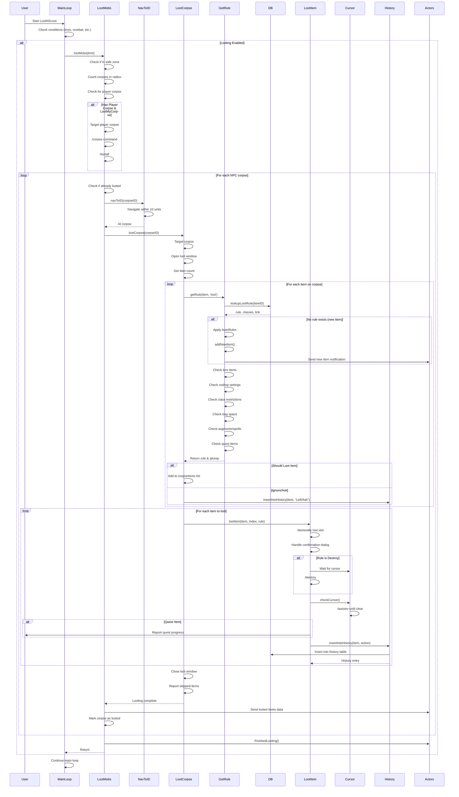

# Looting Corpses Sequence Diagram

## Key Components

### lootMobs()
- Main entry point for corpse looting
- Validates looting conditions (invisibility, zone, combat)
- Finds corpses within configured radius
- Processes player corpse separately if needed
- Iterates through NPC corpses up to configured limit

### lootCorpse()
- Opens loot window for specific corpse
- Scans all items on corpse
- Determines loot action for each item via getRule()
- Separates lore and non-lore items
- Processes items in order
- Reports skipped items

### getRule()
- Looks up existing loot rules from database (Personal > Global > Normal)
- Applies auto-rules for new items if configured
- Validates lore items (already have?)
- Checks nodrop settings
- Validates class restrictions
- Checks bag space availability
- Handles special cases (augments, spells, quest items)
- Returns action: Keep, Sell, Destroy, Ignore, Ask, etc.

### lootItem()
- Executes the actual looting action
- Uses /itemnotify to select item
- Handles nodrop confirmation dialogs
- Destroys items if configured
- Manages cursor via checkCursor()
- Records to history database
- Reports to console/chat

### Database Checks
- lookupLootRule: Checks Personal_Rules > Global_Rules > Normal_Rules
- CheckRulesDB: Queries SQLite database for item rules
- insertIntoHistory: Records looted/ignored items with timestamp

### Actors System
- Sends new item notifications to other characters
- Reports looted items for master looter coordination
- Signals when looting is complete
